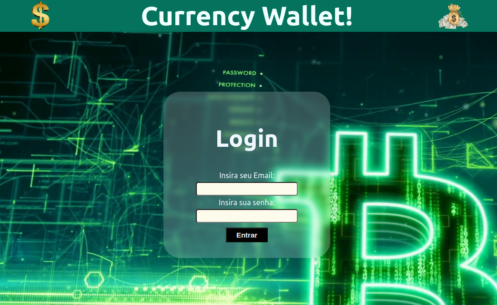
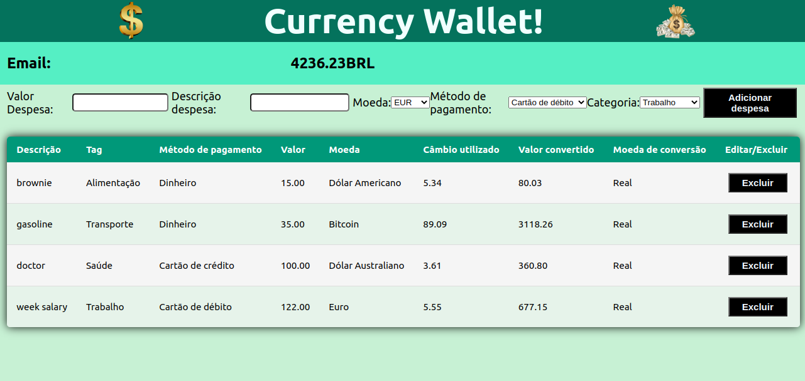

<h1>🤑 💸 Bem vindo ao Currency Wallet! 💵 💰</h1>

# Deploy:

# Resumo do projeto:

O Currency Wallet é uma aplicação front-end que, ao consumir uma API, é capaz de registrar gastos em varias moedas, converter para real e informar o valor total das despesas.

<h3>Principais funcionalidades:</h3>

  - Fazer login (com algum email em formato válido e qualquer senha com mais de 6 caracteres);
  - 
  - 
# Tela de Login:

# Tela de registro de despesas:

# Como rodar o projeto:

Siga os passos abaixo para rodar o projeto! 😃

- git clone
- npm install
- npm start